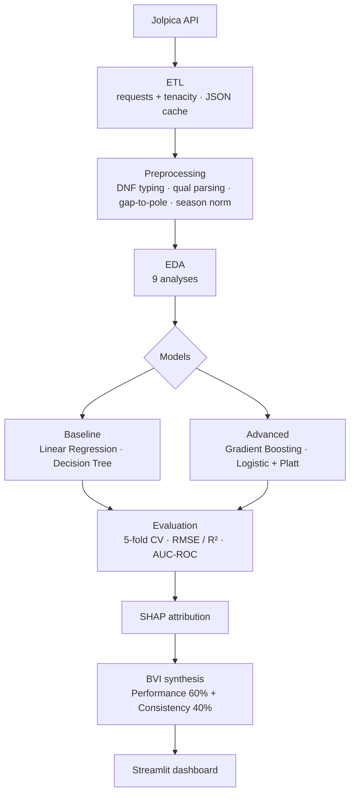

# PitWall Intelligence

> **Predictive Modeling of Formula 1 Constructor Performance and Sponsorship Value Using Machine Learning**

[](https://github.com/DevDharmik/Pitwall-intelligence)
[](https://www.python.org/)
[](LICENSE)
[](https://github.com/DevDharmik/Pitwall-intelligence)

A data-driven Brand Value Index (BVI) for Formula 1 constructors, combining machine-learning performance prediction with SHAP-based explainability — quantifying what is currently a USD 1.8 billion sponsorship market priced largely on perception.

---

## Problem

Formula 1's sponsorship market exceeds USD 1.8 billion annually, with a global audience above 400 million viewers across broadcast, streaming, and digital channels. Yet sponsorship valuation in the sport still relies on brand-perception surveys, media-impression estimates, and subjective prestige scoring. There is no publicly available analytical framework that converts on-track performance into an interpretable, comparable, sponsor-facing metric.

## Research question

> Can explainability techniques applied to structured ML models trained on complete historical race data produce an interpretable composite score of F1 sponsorship value that discriminates between constructors?

## Brand Value Index (BVI)

Two-dimensional composite, season-normalised per constructor:

| Dimension       | Weight | Components                                              |
| --------------- | ------ | ------------------------------------------------------- |
| **Performance** | 60%    | Predicted championship points · podium probability      |
| **Consistency** | 40%    | Reliability indicators · qualifying-to-race delta       |

Min-max normalisation within each season ensures dominant-era seasons do not suppress midfield-team scores in cross-season comparison.

## Headline finding — Sprint 1


Average qualifying gap-to-pole correlates with total constructor points at **Pearson r ≈ –0.79** across 112 team-seasons (p < 0.001). Qualifying pace anchors the BVI Performance dimension.

## Dataset

Single source — **[Jolpica-F1 API](https://api.jolpi.ca/ergast/)**, an actively maintained mirror of the Ergast Developer API for Formula 1. No Kaggle imports, no third-party aggregators, no synthetic data. Every record is fetched live and cached as JSON for reproducibility.

**Focal era:** V6 hybrid, 2014–2024 — eleven complete seasons under stable technical regulations, enabling like-for-like cross-season comparison.

| Table                   | Rows  | Coverage                       |
| ----------------------- | ----- | ------------------------------ |
| `races`                 | 228   | Grands Prix, 2014–2024         |
| `results`               | 4,626 | Race finishing data            |
| `qualifying`            | 4,610 | Q1 / Q2 / Q3 session times     |
| `constructor_standings` | 112   | Constructor-season finals      |
| `driver_standings`      | 247   | Driver-season finals           |
| `constructors` · `drivers` | — | Team and driver metadata       |

## Methodology


```mermaid
flowchart TD
    A[Jolpica API] --> B[ETL<br/>requests + tenacity · JSON cache]
    B --> C[Preprocessing<br/>DNF typing · qual parsing · gap-to-pole · season norm]
    C --> D[EDA<br/>9 analyses]
    D --> E{Models}
    E --> F[Baseline<br/>Linear Regression · Decision Tree]
    E --> G[Advanced<br/>Gradient Boosting · Logistic + Platt]
    F --> H[Evaluation<br/>5-fold CV · RMSE / R² · AUC-ROC]
    G --> H
    H --> I[SHAP attribution]
    I --> J[BVI synthesis<br/>Performance 60% + Consistency 40%]
    J --> K[Streamlit dashboard]
```

## Tech stack

`Python 3.11` · `requests` · `tenacity` · `pandas` · `numpy` · `SQLite` · `scikit-learn` · `shap` · `matplotlib` · `seaborn` · `plotly` · `streamlit`

**Environment:** Google Colab · Jupyter · VS Code

## Sprint plan

| # | Window           | Focus                                | Status      |
| - | ---------------- | ------------------------------------ | ----------- |
| 1 | 23 Apr – 4 May   | ETL pipeline · preprocessing · EDA   | Complete    |
| 2 | 5 May – 18 May   | Baseline + advanced models           | Complete    |
| 3 | 19 May – 1 Jun   | BVI synthesis · SHAP attribution     | Complete    |
| 4 | 2 Jun – 15 Jun   | Streamlit dashboard                  | In progress |
| 5 | 16 Jun – 22 Jun  | Report polish · viva prep            | Planned     |

**Final report due:** 22 June 2026 · **Defence:** 6 July 2026

## Sprint 1 — key findings

1. **Qualifying speed is the strongest single predictor of season points.** Pearson r ≈ –0.79 across 112 team-seasons (p < 0.001), anchoring qualifying pace as a primary Performance input.
2. **The era is defined by sustained dominance.** Mercedes won eight consecutive Constructors' Championships (2014–2021), followed by Red Bull (2022, 2023) and McLaren (2024) — concentration that motivates within-season normalisation.
3. **Constructor rank volatility varies sharply across the era**, feeding the Consistency dimension:

   | Constructor  | σ (rank) | Tier          |
   | ------------ | -------- | ------------- |
   | Williams     | 2.83     | Most volatile |
   | McLaren      | 2.44     | Volatile      |
   | Mercedes     | 1.04     | Stable        |
   | Red Bull     | 0.92     | Stable        |
   | Force India  | 0.84     | Most stable   |

4. **Season concentration ranges from 0.503 (2020, most competitive) to 0.619 (2016, most concentrated)**, with era-wide mean Gini 0.556.

> Numerical findings reflect current Sprint 1 notebook outputs and may be revised after end-to-end re-execution.

## Sprint 2 — key findings

Gradient Boosting predicts end-of-season constructor points at held-out 2024 R² **0.976** (five-fold CV R² 0.950), narrowly ahead of a strong Linear Regression baseline (held-out R² 0.956). Permutation importance shows average grid position accounts for almost all of the explained variance — qualifying pace is the spine of constructor performance. Full metrics: `reports/sprint2_all_models_metrics.csv`; details in `notebooks/docs/sprint_2_summary.md`.

## Sprint 3 — key findings

The two-dimensional Brand Value Index is computed for all 112 team-seasons on a 0–100 scale, combining the Sprint 2 points model with a new calibrated podium-probability classifier — Logistic Regression with Platt scaling, held-out 2024 AUC-ROC **0.928** and Brier 0.071. SHAP attribution on both models confirms starting grid position as the dominant feature. Across 2014–2024 the BVI tracks championship points at a mean Spearman ρ of **0.718** — close enough to be credible, loose enough that the Consistency dimension meaningfully re-ranks teams (2018 Williams, tenth on points, rises to third on reliable grid-to-finish conversion). Scores: `data/exports/bvi_scores.csv`; figures in `reports/`; details in `notebooks/docs/sprint_3_summary.md`.

## Repository structure

```
Pitwall-intelligence/
├── notebooks/
│   ├── 01_etl_jolpica.ipynb         # Jolpica → SQLite, JSON caching + retry
│   ├── 02_preprocessing.ipynb       # cleaning, feature engineering, season normalisation
│   ├── 03_eda.ipynb                 # nine analyses driving Sprint 1 findings
│   ├── 04_features.ipynb            # team_season_features matrix
│   ├── 05_baselines.ipynb           # Linear Regression + Decision Tree
│   ├── 06_advanced.ipynb            # Gradient Boosting · 5-fold CV · permutation importance
│   ├── 07_bvi_shap.ipynb            # podium classifier · SHAP · Brand Value Index
│   └── docs/                        # per-sprint summary write-ups
├── reports/                         # EDA + Sprint 2/3 figures and metrics (PNG, CSV)
├── models/
│   └── gbr_total_points_v1.joblib   # trained Gradient Boosting points model
├── data/
│   └── exports/                     # analytical table snapshots, incl. bvi_scores.csv
├── pitwall.db                       # SQLite analytical store
├── requirements.txt
├── LICENSE
├── .gitignore
└── README.md
```

## Reproducing

```bash
git clone https://github.com/DevDharmik/Pitwall-intelligence.git
cd Pitwall-intelligence
pip install -r requirements.txt
```

Run the notebooks in order in Colab or Jupyter:

1. `01_etl_jolpica.ipynb` — populates `pitwall.db` from the Jolpica API on first run; cached JSON is reused subsequently.
2. `02_preprocessing.ipynb` — builds the analytical tables.
3. `03_eda.ipynb` — generates the Sprint 1 figures in `reports/`.
4. `04_features.ipynb` — engineers the `team_season_features` matrix.
5. `05_baselines.ipynb` · `06_advanced.ipynb` — Sprint 2 models and evaluation.
6. `07_bvi_shap.ipynb` — Sprint 3 podium classifier, SHAP attribution, and Brand Value Index.

The repository ships a populated `pitwall.db`, so notebooks 04–07 can be run directly without re-ingesting from the API.

## Author

**Dharmik Champaneri** — Student ID 20327984
M.Sc. Data Science · University of Europe for Applied Sciences (Berlin / Potsdam)
**Supervisor:** Dr. Humera Noor Minhas
**Module:** Capstone Project · 2026

## License

Code, reports, and figures released under the [MIT License](LICENSE).
